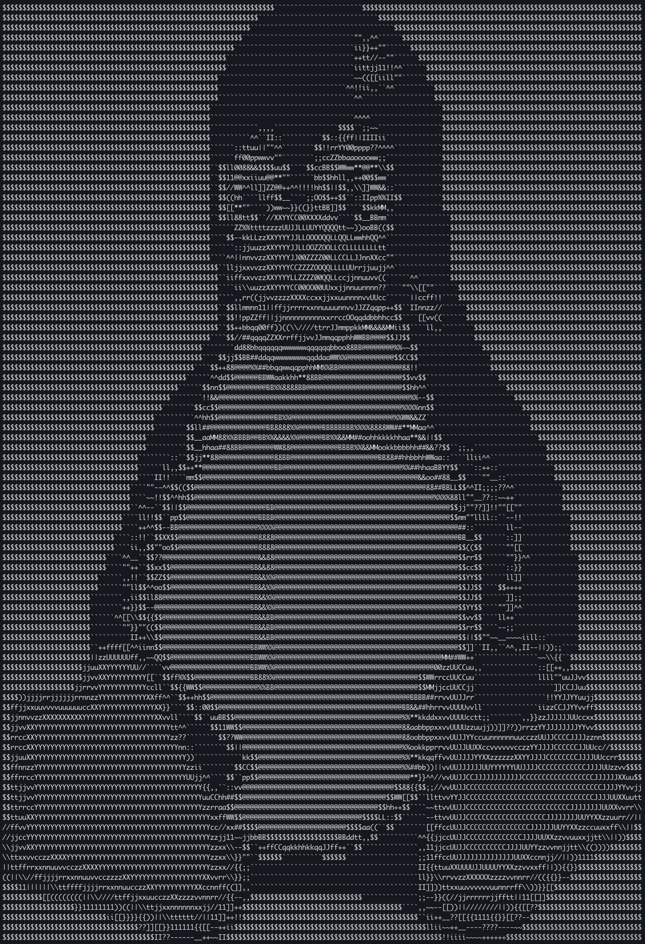

# ascii-art

Generate ASCII art from images using Python.



## Installation and Usage

Prerequisites:
- [Git](https://git-scm.com)
- [Python](https://www.python.org) (Version 3)

In your terminal, run the following commands:
```bash
git clone https://github.com/atudorcarsin/ascii-art.git
cd ascii-art
python -m venv .venv
source .venv/bin/activate # On Windows use `.venv\Scripts\activate`
pip install -r requirements.txt
```
That's it! You can now run the script by executing:
```bash
python main.py <image_file>
```

## Contributing
If you have any improvements or suggestions, feel free to open an issue or submit a pull request. Contributions are welcome!